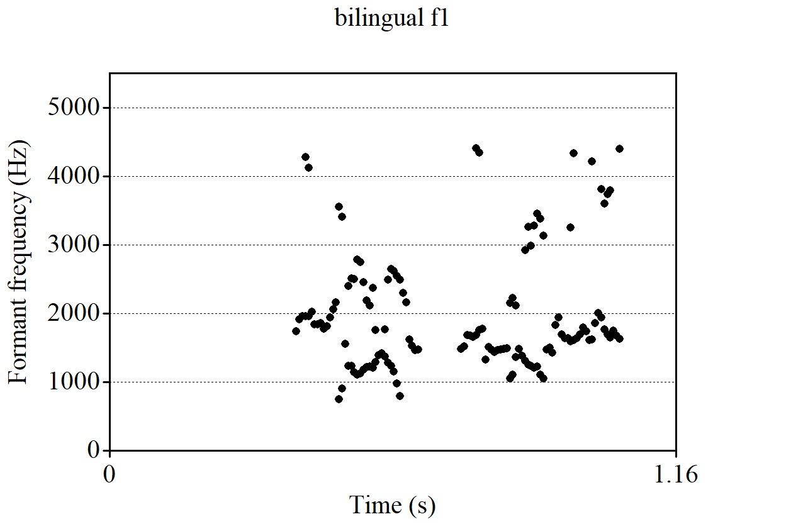

**Author**: Jennifer Markovits  
**Date**: Last update: `r Sys.time()`


# Overview
Kluender and Lotto (2014) stated that the longer the delay between release and the onset of voicing, the higher the frequency of F1 onset since resonance frequency of F1 increases following release as the articulators move away from occlusion. Since VOT in Spanish are shorter than English, Spanish-bilingual can lengthen and shorten their VOTs depending on the language they are speaking. If I assume that bilingual participants of the current data think they are producing Spanish words, it is possible to state that bilingual Spanish-English will have shorter VOT than native English. Therefore, the present report test the hypothesis that Spanish-English bilinguals produce lower F1  than English native speakers after the release of a voiceless stop consonant.


# Prep

## Libraries
cargar base de datos 
```{r, warning=FALSE, message=FALSE}
library(tidyverse)
library(knitr)

```


## Load data

``````{r, warning=FALSE, message=FALSE}


df1 = read_csv("../data/bi01.csv")
df2 = read_csv("../data/bi02.csv")
df3 = read_csv("../data/bi03.csv")
df4 = read_csv("../data/ne01.csv")
df5 = read_csv("../data/ne02.csv")
df6 = read_csv("../data/ne03.csv")
```

## Tidy data

```{r, 'tidy-data'}
df1 = read_csv("../data/bi01.csv")
df2 = read_csv("../data/bi02.csv")
df = bind_rows(df1,df2)
df3 = read_csv("../data/bi03.csv")
df = bind_rows(df, df3)
df4 = read_csv("../data/ne01.csv")
df = bind_rows(df, df4)
df5 = read_csv("../data/ne02.csv")
df = bind_rows(df, df5)
df6 = read_csv("../data/ne03.csv")
df = bind_rows(df, df6)

# separate 
df = df %>%
  separate(fileID, c('language', 'item'), sep =  '_' )

```

# Analysis

## Descriptives

```{r, 'descriptive-stats'}

table = df %>%   
  group_by(language) %>%  
  summarise(mean_f1 = mean(f1),  sd_f1 = sd(f1))
  
kable(table, caption = "table")


table = df %>%   
  group_by(language) %>%  
  summarise(mean_f2 = mean(f2),  sd_f2 = sd(f2))
  
kable(table, caption = "table")


table = df %>%   
  group_by(language) %>%  
  summarise(mean_vot = mean(vot),  sd_vot = sd(vot))
  
kable(table, caption = "table")


```

## Visualization


```{r, 'plots', fig.retina=2}

df = df %>%
  mutate(type_language = ifelse(str_detect(language, 'bi'), 1, 0))

df %>%
  ggplot(aes(x = f1, group = factor(type_language) , fill = factor (type_language))) +
  geom_density(adjust=1.5, alpha=.5)
 

 


knitr::include_graphics('../figures/native_f1.jpg')


```


## Hypothesis test

```{r, 'stats'}
# Conduct a simple statistical analysis here (optional)

df = df %>%
        mutate(type_language = ifelse(str_detect(language, "bi"), 1, 0))
lm1 = lm(f1 ~ type_language, data = df)
summary(lm1)

```


# Conclusion

A linear model was run to examine whether F1 mean differences between English native and bilingual Spanish- English were significant. The model did not find any significant relation between groups. Although table 1 showed differences in F1 mean by groups, and figures  showed differences in formant frequency between groups,  the plot showed an F1 mean overlapping distribution by groups ( 1 bilingual, 0 native English), which is consistent with the LM results. In conclusion, the hypothesis is not supported, suggesting that it is necessary to look for other factors to explain differences in data.

# Reflection

I really enjoy learning coding, although it is very easy to get frustrate. However I think the learning curve is up. I really get ansious when I got problems setting paths. I had problems in Praat and also when I wanted to get the data in R. That part was really frustrating, since so far I though that I was able to, at least, loading the data in R, but I could not do it at the begining. But, it is very motivating when you find a solution, and I did.
I learned use kable function, and mutate using str_detect. 


