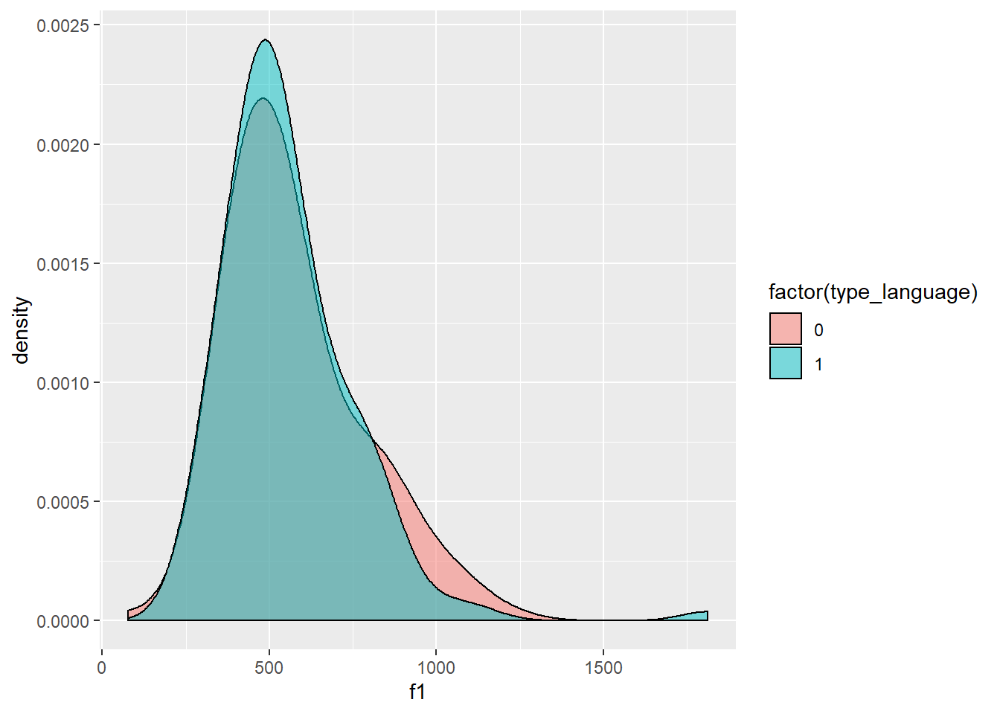

Programming assignment 4
================

**Author**: Jennifer Markovits  
**Date**: Last update: 2020-04-22 07:46:14

# Overview

Kluender and Lotto (2014) stated that the longer the delay between
release and the onset of voicing, the higher the frequency of F1 onset
since resonance frequency of F1 increases following release as the
articulators move away from occlusion. Since VOT in Spanish are shorter
than English, Spanish-bilingual can lengthen and shorten their VOTs
depending on the language they are speaking. If I assume that bilingual
participants of the current data think they are producing Spanish words,
it is possible to state that bilingual Spanish-English will have shorter
VOT than native English. Therefore, the present report test the
hypothesis that Spanish-English bilinguals produce lower F1 than English
native speakers after the release of a voiceless stop consonant.

# Prep

## Libraries

cargar base de datos

``` r
library(tidyverse)
library(knitr)
```

## Load data

``` r
df1 = read_csv("../data/bi01.csv")
df2 = read_csv("../data/bi02.csv")
df3 = read_csv("../data/bi03.csv")
df4 = read_csv("../data/ne01.csv")
df5 = read_csv("../data/ne02.csv")
df6 = read_csv("../data/ne03.csv")
```

## Tidy data

``` r
df1 = read_csv("../data/bi01.csv")
```

    ## Parsed with column specification:
    ## cols(
    ##   fileID = col_character(),
    ##   f1 = col_double(),
    ##   f2 = col_double(),
    ##   vot = col_double(),
    ##   notes = col_character()
    ## )

``` r
df2 = read_csv("../data/bi02.csv")
```

    ## Parsed with column specification:
    ## cols(
    ##   fileID = col_character(),
    ##   f1 = col_double(),
    ##   f2 = col_double(),
    ##   vot = col_double(),
    ##   notes = col_logical()
    ## )

``` r
df = bind_rows(df1,df2)
df3 = read_csv("../data/bi03.csv")
```

    ## Parsed with column specification:
    ## cols(
    ##   fileID = col_character(),
    ##   f1 = col_double(),
    ##   f2 = col_double(),
    ##   vot = col_double(),
    ##   notes = col_logical()
    ## )

``` r
df = bind_rows(df, df3)
df4 = read_csv("../data/ne01.csv")
```

    ## Parsed with column specification:
    ## cols(
    ##   fileID = col_character(),
    ##   f1 = col_double(),
    ##   f2 = col_double(),
    ##   vot = col_double(),
    ##   notes = col_logical()
    ## )

``` r
df = bind_rows(df, df4)
df5 = read_csv("../data/ne02.csv")
```

    ## Parsed with column specification:
    ## cols(
    ##   fileID = col_character(),
    ##   f1 = col_double(),
    ##   f2 = col_double(),
    ##   vot = col_double(),
    ##   notes = col_logical()
    ## )

``` r
df = bind_rows(df, df5)
df6 = read_csv("../data/ne03.csv")
```

    ## Parsed with column specification:
    ## cols(
    ##   fileID = col_character(),
    ##   f1 = col_double(),
    ##   f2 = col_double(),
    ##   vot = col_double(),
    ##   notes = col_logical()
    ## )

``` r
df = bind_rows(df, df6)

# separate 
df = df %>%
  separate(fileID, c('language', 'item'), sep =  '_' )
```

# Analysis

## Descriptives

``` r
table = df %>%   
  group_by(language) %>%  
  summarise(mean_f1 = mean(f1),  sd_f1 = sd(f1))
  
kable(table, caption = "table")
```

| language | mean\_f1 |   sd\_f1 |
| :------- | -------: | -------: |
| bi01     | 520.2511 | 138.3988 |
| bi02     | 526.7989 | 135.9110 |
| bi03     | 620.2478 | 277.8495 |
| ne01     | 608.8147 | 235.1393 |
| ne02     | 536.1238 | 203.1249 |
| ne03     | 573.2240 | 148.2025 |

table

``` r
table = df %>%   
  group_by(language) %>%  
  summarise(mean_f2 = mean(f2),  sd_f2 = sd(f2))
  
kable(table, caption = "table")
```

| language | mean\_f2 |   sd\_f2 |
| :------- | -------: | -------: |
| bi01     | 1727.237 | 666.6207 |
| bi02     | 1601.935 | 667.3874 |
| bi03     | 1720.184 | 710.9667 |
| ne01     | 1868.243 | 728.4546 |
| ne02     | 1828.544 | 660.0103 |
| ne03     | 1653.120 | 569.8621 |

table

``` r
table = df %>%   
  group_by(language) %>%  
  summarise(mean_vot = mean(vot),  sd_vot = sd(vot))
  
kable(table, caption = "table")
```

| language | mean\_vot |   sd\_vot |
| :------- | --------: | --------: |
| bi01     |  26.19733 | 23.572779 |
| bi02     |  21.94378 |  8.247008 |
| bi03     |  18.40311 |  6.649617 |
| ne01     |  12.71444 |  7.846749 |
| ne02     |  30.58800 | 15.824477 |
| ne03     |  28.69200 | 15.017324 |

table

## Visualization

``` r
df = df %>%
  mutate(type_language = ifelse(str_detect(language, 'bi'), 1, 0))

df %>%
  ggplot(aes(x = f1, group = factor(type_language) , fill = factor (type_language))) +
  geom_density(adjust=1.5, alpha=.5)
```



``` r
knitr::include_graphics('../figures/bilingual_f1.jpg')
```

<!-- -->

``` r
knitr::include_graphics('../figures/native_f1.jpg')
```

<!-- -->

## Hypothesis test

``` r
# Conduct a simple statistical analysis here (optional)

df = df %>%
        mutate(type_language = ifelse(str_detect(language, "bi"), 1, 0))
lm1 = lm(f1 ~ type_language, data = df)
summary(lm1)
```

    ## 
    ## Call:
    ## lm(formula = f1 ~ type_language, data = df)
    ## 
    ## Residuals:
    ##     Min      1Q  Median      3Q     Max 
    ## -494.74 -133.13  -42.77   92.54 1255.13 
    ## 
    ## Coefficients:
    ##               Estimate Std. Error t value Pr(>|t|)    
    ## (Intercept)     572.72      17.17  33.354   <2e-16 ***
    ## type_language   -16.95      24.28  -0.698    0.486    
    ## ---
    ## Signif. codes:  0 '***' 0.001 '**' 0.01 '*' 0.05 '.' 0.1 ' ' 1
    ## 
    ## Residual standard error: 199.5 on 268 degrees of freedom
    ## Multiple R-squared:  0.001816,   Adjusted R-squared:  -0.001909 
    ## F-statistic: 0.4875 on 1 and 268 DF,  p-value: 0.4857

# Conclusion

A linear model was run to examine whether F1 mean differences between
English native and bilingual Spanish- English were significant. The
model did not find any significant relation between groups. Although
table 1 showed differences in F1 mean by groups, and figures showed
differences in formant frequency between groups, the plot showed an F1
mean overlapping distribution by groups ( 1 bilingual, 0 native
English), which is consistent with the LM results. In conclusion, the
hypothesis is not supported, suggesting that it is necessary to look for
other factors to explain differences in data.

# Reflection

I really enjoy learning coding, although it is very easy to get
frustrate. However I think the learning curve is up. I really get
ansious when I got problems setting paths. I had problems in Praat and
also when I wanted to get the data in R. That part was really
frustrating, since so far I though that I was able to, at least, loading
the data in R, but I could not do it at the begining. But, it is very
motivating when you find a solution, and I did. I learned use kable
function, and mutate using str\_detect.
